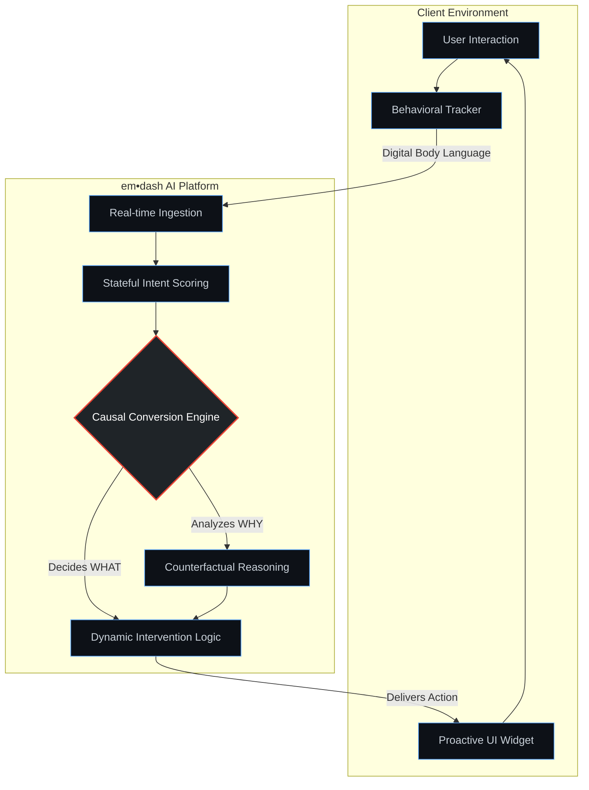

<h1 align="center">Hi there! I'm Tim 🚀</h1>
<h3 align="center">Founder & 0→1 Product Architect at space+ultra | AI Product Lab</h3>

  
  
  

---

I don't just build software; I architect intelligent, stateful, and outcome-driven AI systems that solve the web's most complex interaction challenges. My approach is rooted in systems thinking — deconstructing business processes to their foundational level to design AI-native solutions that drive real-world impact.

### 🔭 Currently Building

* **`em•dash`** — A proactive AI agent for B2B SaaS platforms. Powered by our proprietary **Causal Conversion Engine**, it reads "digital body language" and moves beyond simple correlation to understand *why* users act, turning unspoken intent into measurable revenue.
* **Lab-to-Product R&D** — Engaging in deep R&D partnerships to validate core hypotheses and generate proprietary insights that fuel our product ecosystem.

### 🛠️ Architecture & Tech Stack

<b>⚙️ How em•dash Works: High-Level Concept (Click to expand)</b>

 

---

### 🌟 Core Expertise

* **AI-Native Product Strategy:** Building products from zero, centered on AI capabilities.
* **Causal & Proactive AI:** Designing systems that move beyond passive analytics to proactively act.
* **B2B SaaS Revenue Engines:** Architecting solutions that directly address conversion and revenue.
* **Systems Thinking:** Deconstructing complex problems into governable, stateful components.

---

<b>🌌 Why space+ultra? (Click to expand)</b>

The name reflects our mission of pushing boundaries and exploring new dimensions in data and AI.

* **"Space"** represents the **digital space** where 98% of user interactions happen unseen. It's the "space" of anonymous user behavior and unspoken intent—the "digital body language" that most companies fail to read. We architect systems that finally read that room.
* **"Ultra"** signifies our commitment to go beyond conventional solutions. It's our drive to move:
* Beyond passive analytics to **proactive engagement**.
* Beyond simple Correlation to find deep **Causality**.
* Beyond just *insights* to create measurable *impact*.

Inspired by "non plus ultra" (nothing further beyond), **space+ultra** is our mission to push past the known edge of analytics and redefine what's possible with AI.

