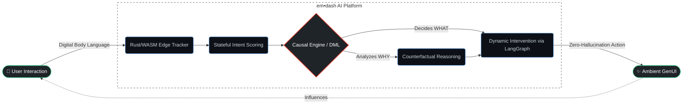

<h1 align="center">Hi there! I'm Tymur 🚀</h1>
<h3 align="center">Forward Deployed AI Engineer & 0→1 Product Architect | space+ultra</h3>

  
  
  

---

I operate at the intersection of high-level system design and direct enterprise engagement, translating ambiguous business workflows into deterministic, outcome-driven AI architectures. I utilize an AI-native orchestration paradigm—directing "lights-out" agentic development workflows (like Google Jules) to maintain massive architectural context and ship complex systems at extreme velocity.

### 🔭 Recent & Active Architectures

* **`Baumind`** — An enterprise AI Copilot for BIM model auditing and building code compliance. Architected using a hierarchical LangGraph multi-agent swarm and a custom Zero-Payload C# MCP server to ensure strict regulatory data isolation within legacy CAD environments.
* **`em•dash`** — A proactive AI agent for B2B SaaS powered by a proprietary **Causal Conversion Engine**. It leverages Double Machine Learning (DoWhy, EconML) and a sub-30ms Rust/WASM edge tracker to evaluate "digital body language" and mathematically prove Net Incremental Revenue (NIR).
* **`UE5 Workflow Automator`** — A complex Unreal Engine 5 automation plugin (94,000 LOC of C++) developed and deployed in 10 weeks by orchestrating autonomous AI coding pipelines (Google Jules, Antigravity).

### 🛠️ Architecture & Agentic Tech Stack

<b>⚙️ System Architecture: The em•dash Concept (Click to expand)</b>

 

```mermaid
flowchart LR
    A([👤 User Interaction]) -->|"Digital Body Language"| B(Rust/WASM Edge Tracker)
    
    subgraph Platform ["em•dash AI Platform"]
        direction LR
        B --> C(Stateful Intent Scoring)
        C --> D{Causal Engine / DML}
        D -->|"Analyzes WHY"| E(Counterfactual Reasoning)
        D -->|"Decides WHAT"| F(Dynamic Intervention via LangGraph)
        E --> F
    end

    F -->|"Zero-Hallucination Action"| G([✨ Ambient GenUI])
    G -.->|"Influences"| A

    classDef default fill:#0D1117,stroke:#58A6FF,stroke-width:1px,color:#C9D1D9;
    classDef engine fill:#1F2428,stroke:#EA4335,stroke-width:2px,color:#FFF;
    classDef edge fill:#1F2428,stroke:#3ECF8E,stroke-width:1px,color:#FFF;
    
    class D engine;
    class A,G edge;
    style Platform fill:none,stroke:#30363d,stroke-width:1px,stroke-dasharray: 5 5
```

---

### 🌟 Core Expertise

* **AI-Native Engineering Paradigm:** Accelerating SDLC through the orchestration of agentic workflows while maintaining strict architectural governance.
* **Production-Grade Integration:** Embedding frontier AI capabilities into strictly regulated, heterogeneous legacy infrastructures via Zero-Payload secure patterns.
* **Evaluation & Reliability:** Designing causal inference frameworks (DoWhy, EconML) and continuous placebo testing to mathematically prove business impact and prevent hallucinated ROI.
* **Multi-Agent Orchestration:** Deconstructing complex enterprise bottlenecks into stateful, hierarchical multi-agent swarms using LangGraph.

---

<b>🌌 Why space+ultra? (Click to expand)</b>

The name reflects our mission of pushing boundaries and exploring new dimensions in data and AI.

* **"Space"** represents the **digital space** where 98% of user interactions happen unseen. It's the "space" of anonymous user behavior and unspoken intent—the "digital body language" that most companies fail to read. We architect systems that finally read that room.
* **"Ultra"** signifies our commitment to go beyond conventional solutions. It's our drive to move:
  * Beyond passive analytics to **proactive engagement**.
  * Beyond simple correlation to find deep **causality**.
  * Beyond manual code generation to **autonomous agentic orchestration**.

Inspired by "non plus ultra" (nothing further beyond), **space+ultra** is our mission to push past the known edge of system design and redefine what's possible with AI.

